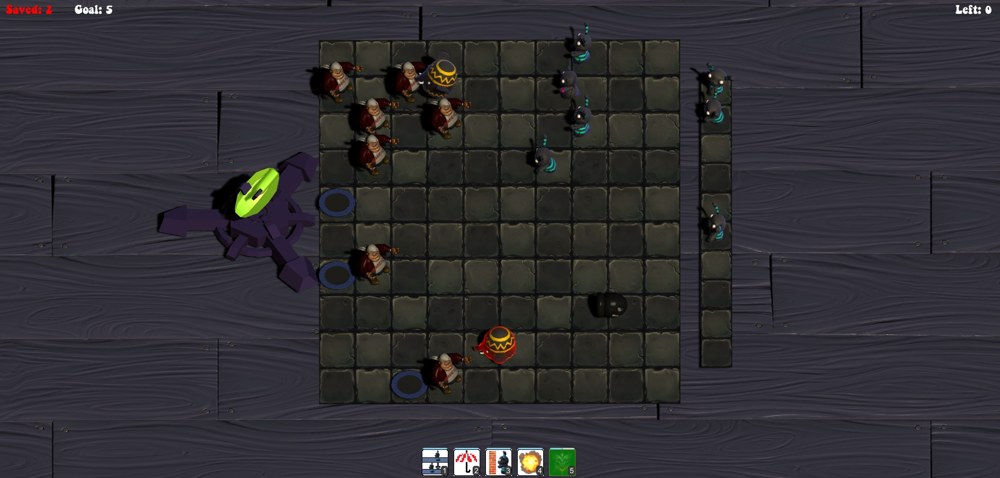

# Lemmings

Developed for the class of Computer Games Development (EIC0090) at MIEIC, FEUP. 

Lemmings was created as prototype game for the team to get acquainted with game development and the Unity 5 engine. In this game largely inspired by the traditional Lemmings, Plants vs. Zombies, and the tower defense genre, players attempt to reach a checkpoint with a small army of creatures and various powers.

## Team Members
- Cristiano Carvalheiro - ei10041@fe.up.pt
- Hugo Cardoso - ei11154@fe.up.pt
- Noelia Giner - up201401780@fe.up.pt
- Vasco Gomes - ei11161@fe.up.pt 

## Screenshots

